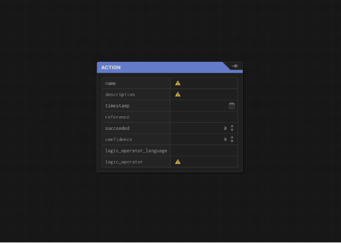
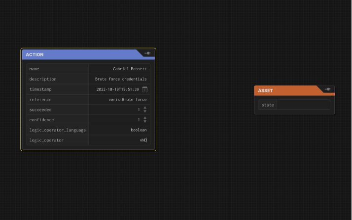
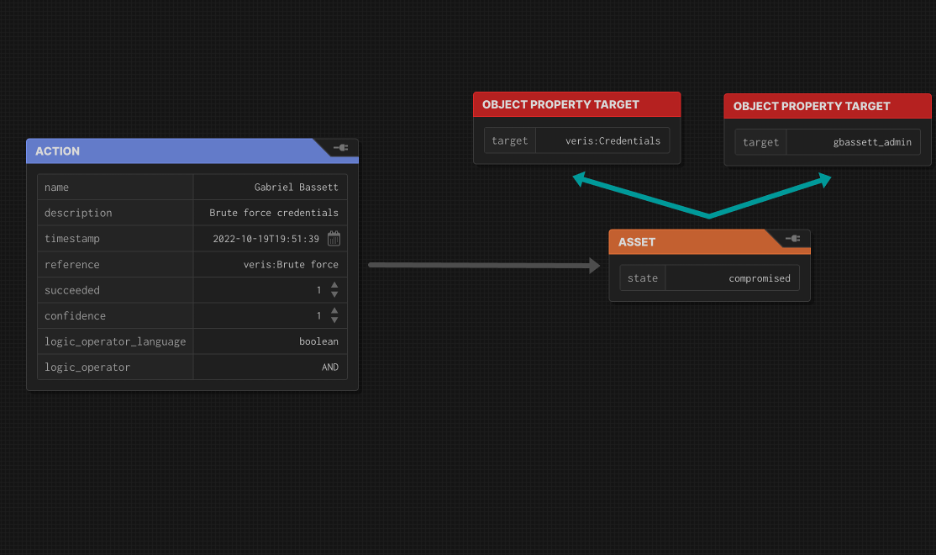
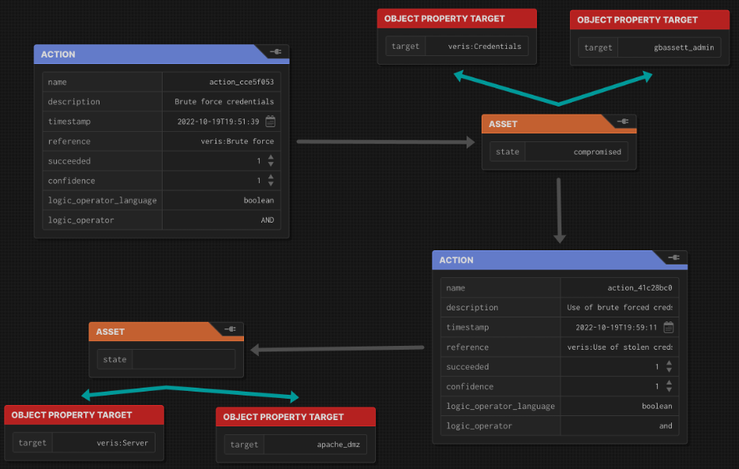

# Attack Flow Processes – Basics

# Introduction

Attack Flow is useful in a wide variety of use cases. Many of them have their own unique uses, however many of them share commonalities. This document will provide processes for Attack Flow that are useful in all other use cases.

# TL:DR

Ok, you opened this documenting wanting to get started. But then you saw that it's really long. Start here and reference the rest as you need. You should have an idea about what you want to describe. We'll. Use the attack flow designer from [https://github.com/center-for-threat-informed-defense/attack-flow](https://github.com/center-for-threat-informed-defense/attack-flow), but note it isn't geared towards graphs. Additional documentation will explain how to create them with SPARQL (a graph query language that makes it very easy) and the forthcoming Flow Manager:

1. Right click and create an action, filling in the fields, (mainly name, description, timestamp, reference, and "AND" for logic\_operator if you weren't sure what to put there). Actions are something that changes an Asset. If you're unsure what to put in the properties, skip down to the discussion of action properties below

2. Right click and create an asset. Add any properties such as a reference and name. (by right clicking and creating ObjectProperties)

3. Create edges between the action and asset. Label it with "compromised" since that's what happened. (Other options are in the 'State' discussion below.)

4. Repeat until you're done. Remember, you can add more properties. Use DataProperties for things classes or instances of classes (programmer reference) and DatatypeProperties for variables (the number 5, an md5sum, etc).

5. That's it. When you're done, export and save it as JSON.

# Creating the flow

First you must create a flow node (kinda like the metadata for the flow). Each flow is defined by a flow node with a set of properties:

- ID (required) A URI. This is what uniquely identifies this node. It works well to use a UUID prefixed with 'flow\_' within an organization-specific namespace. For example, org1.com/flows#flow\_39ebd2cc-22e3-4287-ab86-2bbba2bbd038. Since this isn't particularly easy to read, the 'name' can be used as a human readable name.
- (required) A string. This can be a truncated form of the UUID (ex "Flow 39ebd2cc"), something more descriptive ("web server attack 1"), or anything else that makes sense for the organization.
- Created (required) An ISO standard datetime. Just put the current time here.
- Description (optional) A string. Since the UUID probably shouldn't be particularly descriptive (to be short and avoid conflicts) and the name may not be particularly descriptive, the description is a place to type a one or two sentence summary of the flow. Remember, the details are in the flow itself. This field is likely to be used by folks trying to decide whether to look at the full flow or not.
- Author (optional) In Attack Flow 1, this is described as a string. I would recommend instead storing it as a Friend of a Friend (FOAF) person.

Ok, you probably don't know what FOAF is. The short answer is: someone else has already come up with how to define a person in a repeatable and usable way. You can read it here: [http://xmlns.com/foaf/0.1/](http://xmlns.com/foaf/0.1/).

The bigger thing though is that Attack Flow is built on a standard called Knowledge Graphs. Knowledge graphs are about as deep a rabbit hole as you can dive down and we didn't bring spelunking gear so we're not going there right now.

Instead, just remember the benefit of knowledge graphs: a lot of people have already defined how to define a lot of things. Here's a quick list:

  - FOAF defines people.
  - VERIS and ATT&CK define many things about, well, attacks.
  - TIME ([http://www.w3.org/2006/time](http://www.w3.org/2006/time)) defines, well, time.
  - RDF (http://www.w3.org/1999/02/22-rdf-syntax-ns) defines 'types' (as in 'server' is a _type_ of asset)
  - RDFS (http://www.w3.org/2000/01/rdf-schema) defines definitions
  - OWL (http://www.w3.org/2002/07/owl) defines DatatypeProperties like strings or number, ObjectProperties like people, NamedIndividual (think if ROAF creates a 'class' for people, a NamedIndividual is an instance of a class), as well as 'SameAs' for when you call the same thing two different names (trust me, it'll happen)

Each of the above defines TONS of other things. You can ignore anything you don't actually have to use.

A couple other ones that define useful stuff that you are likely to run into are Dublin Core (DC), Dubline Core Terms (DCTerms), dbpedia.org Ontology (DBO), dbpedia.org Resource (DBR), and schema.org. All of these are namespaces. Even Attack Flow itself is a namespace. Your organization may even choose to create its own namespace to cover things like its assets, people, and buildings. (This would allow them to be referenced in attack flows.)

Ok, back to the actual work.

# Creating a step in an Attack Flow

The first think to consider Is every 'step' of an attack involves multiple parts. In attack flow, that is four things:

1. The required state for an action to occur
2. The action taken
3. The state it changed in the asset
4. The asset changed

For example, exploiting a vulnerability in a webserver involves:

1. Knowledge & access to the webserver
2. The ability to execute the exploit
3. The resulting state change on the web server (defacement, Leak data, Install a webshell, etc)
4. The web server

This may not come naturally. Defenders tend to think in terms of the asset while offense tend to think in terms of the action. Especially for offense, it may be hard to think of what the asset is. There are two tricks to making this easier.

1. Choose from a list of assets. Pulling form the VERIS framework it might be:
  1. Person
  2. Server
  3. User Device
  4. Terminal or Kiosk
  5. Embedded system
  6. Network
  7. Data

Note that VERIS defines varieties of each asset category.

If using the CARS data model, it might be host subsystems such as:

  1. Network interfaces
  2. Memory
  3. Compute
  4. Storage
1. Think "What was the effect of the action and what was effected?" Effects can be categorized as:
  1. Confidentiality
  2. Integrity
  3. Availability

or a variety thereof. Using those two tricks, it should be much easier to identify the asset.

# Filling in required properties

Within attack flow, each part of the step has properties, some optional, some required.

##

## Lets start with actions:

- ID (required) A URI. This is what uniquely identifies this node. It works well to use a UUID prefixed with 'action\_' within an organization-specific namespace. For example, org1.com/flows#action\_e768bf76-77a0-46cb-9e75-92da0af976c7. (So, basically like Flow. And guess what, Asset and ObjectProperties will be the same.)
- (required) A string. This can be a truncated form of the UUID (ex "Action e768bf76"), something more descriptive ("web server attack 1"), something not particularly descriptive ("action 1"), or anything else that makes sense for the organization.
- Timestamp (required) An ISO standard datetime, but I would recommend using unix time as an integer here. This is actually kinda important. The reason has to do with the order things happen in.

Ok, So there's two sources of order in Attack Flow. First, Attack Flow is a graph. Actions lead to assets, which lead to more actions. Because of that, you can safely assume that an action that comes from an asset that came from an action is later in the causal path. But what if two assets come from a single action, which then leads to two more actions? Or if two actions happen with no common parent? This is where the timestamp comes it. It is fairly important to the temporal sequence in which things occur.

Now for flows that have actually happened, it's easy to assign a real timestamp. But what if you are documenting a plan, or a flow where you don't know the details, or a generic example of an attack? In those cases you don't have an exact timestamp. Because of this, an integer that can serve as both time since epoc or the temporal sequence of events may be better than an ISO timestamp

- Description (optional) A string. Since the UUID probably shouldn't be particularly descriptive (to be short and avoid conflicts) and the name may not be particularly descriptive, the description is a place to type a short summary of the action. Again, keep it short. No-one wants to read a ton of action descriptions.
- Reference (optional, but highly recommended) A string in Attack Flow 1, but I would treat this as a URI. The reason is that your action, (we'll call it Action\_1) is a NamedIndividual (an instance) of a class of action. Reference points to what that class is (For VERIS, the classes would be Hacking, Malware, Social, Misuse, Error, Physical, Environmental.)
- Logic\_operator (required) A string. If you're not sure what to put here, use 'AND'. If you want to know why, read the box below this list.
- Logic\_operator\_language (optional) A string. If you're not sure what to put hee, use 'boolean'. If you want to know why, same as logic\_operator. Read the box below.
- Succeeded (optional) A number between 0 and 1. Probably 1 (i.e. succeeded). Maybe 0 (failed). Potentially something in between. If the action hasn't happened, maybe just skip this property.
- Confidence (optional) A number between 0 and 1. Probably 1 (we know it happened). Probably not 0 (we know nothing about if it happened or not). Maybe something in between. If you're not sure what to do, just leave it out.

Ok, I promised a box related to logic\_operator and logic\_operator\_language. These don't mean much if you have a single path that goes something like action-\>asset-\>action-\>asset. But what if you have something that goes action1-\>asset\<-action2? Does that mean both action1 AND action 2 need to happen? Does it mean action1 OR action2 need to happen? That's where the logic\_operator comes in. It defines any logic needed to clarify if the action occurs or not. (So if you're documenting an attack after-the-fact, you probably don't need it as much.)

In the case above, the logic operators are Boolean (hense logic\_operator\_language being Boolean). But what if you have a ton of actions, maybe some various properties (attacker has a credential or software is at some vulnerable version) or need some really complex logic? Well, just make logic\_operator a function in the language of your choosing (I'd go javascript or python but that's just me. Feel free to use rust, ladder logic, or whatever. You do you). Just make sure you indicate the language in logic\_operator\_language so folks know how to interpret it.

## Assets:

- ID (required) A URI. This is what uniquely identifies this node. It works well to use a UUID prefixed with 'asset\_' within an organization-specific namespace. For example, org1.com/flows#asset\_3630f3ea-704d-4311-b8fb-530dc47d7c96.
- State (optional) A string in Attack Flow 1. But I'd make it a URI referring to a namespace like VERIS which has the attributes: Confidentiality, Integrity, and Availability.
- Attack Flow doesn't lets you keep adding properties. If I were you, I'd include Reference, (maybe to your organization's asset management tool). And if the tool doesn't already include a name and description, I'd probably add those too. Just look at how they're done for action. If those things are in the asset management tool though. Don't reinvent the wheel.

Yep, another box. This one's about \_state\_. Something to keep in mind is that actions change the state of things. If the action doesn't change anything, it really didn't do anything. The edge (I know, we haven't discussed edges) from the action to the asset will list what it changed. But once that change has occurred, it becomes the State property.

This paragraph's going to get a bit philosophical. Skip it if you want. So when an attack occurs, it changes things. One of the reasons for flows (maybe \_the\_ reason) is to track those changes. We call the sum total of all those changes "state". So where is this mythical "state" stored? Well, it's adding up the set of all the assets involved. That's simple enough. You can make a table listing the asset in one column then the state in another.

But what if we need the state not just at the beginning and end of the attack. (Hint: at the beginning, nothing has changed.) Amazingly, it's the same thing. The set of the states of all the asset. The trick, is it's only up to the time you choose. So you ignore any state\_changes caused by Actions with a later timestamp. (The state\_change on the edges from those later Actions to Assets should not be included as State properties for the respective Assets yet.) For state\_changes that have happened, they should now be State properties on the Assets and part of that list that makes up overall state.

## ObjectProperties:

- ID (required) A URI. These are easy. They're just a URI of an object. It might be something like a Nashville which is a location defined in DBR (see above). It might be a person. It might be a reference to a VERIS or ATT&CK object.
- Because it's an object, it can have it's own properties, but because an ObjectProperty can be anything, there's no list for what those properties are. If you chose the Object from a namespace, that namespace probably defines it's properties.

## DatatypeProperties:

- A value. Yep, that's it. A value. Datatype Properties just store strings, numbers etc. Sometimes you need those. (Like when you want to note a specific MD5 checksum.)

## Relationships (also called edges or triples):

- Source (Subject) A URI. Also called the beginning, etc.
- Type (predicate) A URI.
- Target (object) A URI or a DatatypeProperty. Also called the Destination, End, etc.

Time for a quick confession. Literally everything above is just a relationship. Actions and Flows? They're just several relationships between the Action/Flows's URI and the properties. Assets? Triples of \<Asset URI, attack\_flow:State, State URI. Object properties? \<subjectObject (an Action, Asset, Flow, or other ObjectProperty), property name, target object\>. Datatype Properties? \<subjectObject, property name, value\>.

In fact, that's all knowledge graphs are. Just triples. You can store a graph as just three columns in a spreadsheet. It's one of the reasons knowledge graphs are both so simple and so powerful.

That said, we have a couple specific relationships Attack Flow uses.

## State\_change relationships:

Still just a triple, but the Source must have a type of "Action" and the Target must have a type of "Asset". (We'll make an exception and let the Source or Target be a Flow too if the Flow is used to represent a bunch of actions/assets, called a subgraph.) It also makes sense to be more specific about what the state\_change was. It might be "Compromised". It might be more detailed: "Confidentiality", "Integrity", "Availability". It's up to you.

That means an example relationship might be like: \<Brute force, Confidentiality, credential1\>. You could read this as "The action Brute force was used to compromise the Confidentiality of the credential1".

## State\_requirement relationships:

Again, just a triple. But the Source must have a type of "Asset" and the Target must have a type of "Action" (again with the leniency for Flows described in "state\_change relationships"). This describes what has to be true to take the action.

Lets say credential1 was compromised as above. The next action might be to use those stolen creds. The triple might look like: \<Credential1, Confidentiality, Use of stolen creds\> meaning "Credential1 must have it's Confidentiality compromised for the Use of stolen creds Action to occur.

# Connecting Steps Together

Whew. That first part was long. The good news is it's basically everything you need to know. From here on out, you're connecting those steps you defined together to form the full flow. This should be pretty straight forward if you just have a single path. Keep connecting Action to Asset to Action. To Asset until you are done.

Where you may get confused is when your flow branches or converges. Branching is probably easier. It may be that the compromise of one Asset leads to multiple actions. (Think compromising a server, exfiltrating the data on it, then encrypting it for ransomware.) Simply create the two Actions, draw a relationship from the asset to each of the actions, and make sure to set the Action times such that they happen in the temporal order they happened in. This also works for an Action that compromises multiple Assets, however that's going to be less common since usually it's multiple NamedIndividuals of a single action, repeated once per asset. Still, it can happen and you have a lot of discretion in how to code it.

It's also possible for multiple compromised Assets to be required for a single Action, or multiple actions to be taken against a single Asset. For example, the Action of SQLi on the DMZ webserver database, may require the DMZ webserver be in a compromised State, _and_ have compromised the Confidentiality of the database credentials. Alternately, it's incredibly common for multiple Actions to be taken against a single Asset. In fact many Actions may go from the Asset back to the same Asset. Take for example, using a driveby exploit Action to compromise a user account on a desktop asset. Then using mimikatz (a malware Action) to compromise privileged credentials (a data Asset) and using them to elevate privileges on the same desktop Asset. The desktop Asset would have to actions coming in: The driveby exploit and the use of the stolen credentials.

# Finishing the Flow

So you've done all that. You should now have a SPARQL query, a JSON-LD graph, or a json schema file. You can keep them as flat files or potentially insert them into a database, (graph, JSON, etc). Unfortunately it's not really the scope of this document of discuss actually using yoru flows. Still, it's wholly possible to use them for documenting Red Team tests (both the plan and the test report), Attack Simulation (though this is a little more complicated), Detection Signatures, Threat Intelligence, Incident Response, Architecture engineering and planning, and Executive Communication. See the additional documentation as it becomes available for details of these use cases. (Or watch the bsidesLV Presentation on it: https://www.youtube.com/watch?v=NwSd6tAA-eI.)

